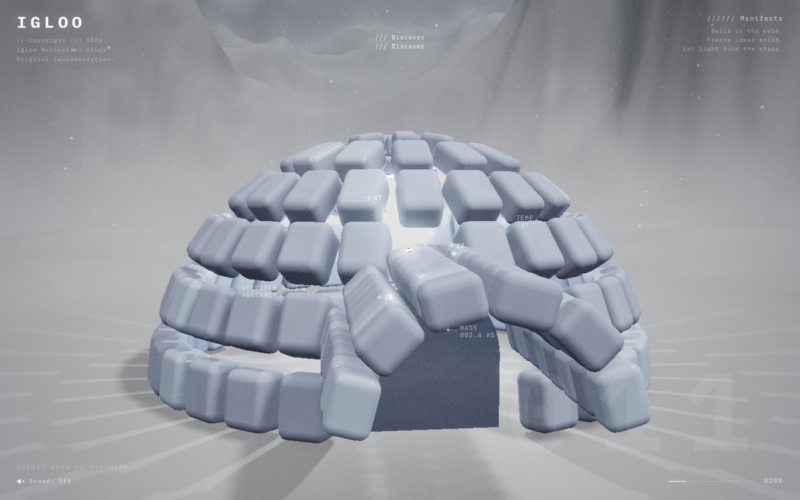
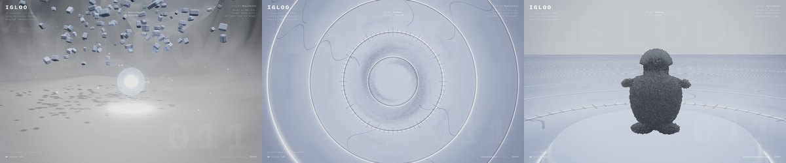
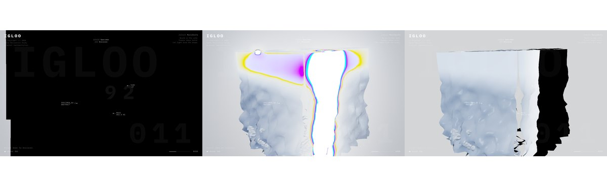

<div align="center">


# webgl-scroll-site

**An agent skill for building immersive scroll-driven 3D websites.**

Drop it into pi, Prime Agent, or Claude Code and your agent can build the
"award site" genre end to end: a fixed canvas where scrolling drives a cinematic
camera through chapters of procedural three.js scenes, graded by a
post-processing chain — then *prove the frames are correct* with a numeric,
headless QA gate instead of squinting at screenshots.

[](LICENSE)






*Every frame above is procedural — no models, no textures, no HDRIs. Built by
agents following this skill.*

</div>

---


## Supported hosts

| Host | Install | Notes |
|---|---|---|
| pi | `./install.sh pi` | `~/.pi/agent/skills/` |
| Prime Agent | `./install.sh prime` | `~/.prime/agent/skills/` |
| Claude Code (skill) | `./install.sh claude` | `~/.claude/skills/` |
| Claude Code (plugin) | `claude plugin marketplace add <this repo>` then `claude plugin install webgl-scroll-site@pi-webgl-scroll-site` | manifests in `.claude-plugin/`, validated with `claude plugin validate --strict` |
| opencode | `./install.sh opencode` or symlink | native skill support ≥1.18; see [adapters/opencode](adapters/opencode/README.md) |
| Project-local | `./install.sh local <dir>` | `.pi/skills/` + **required** `AGENTS.md` entry (printed by the installer) |

Host-specific details: [adapters/claude-code](adapters/claude-code/README.md) · [adapters/opencode](adapters/opencode/README.md). CI proves the scaffold end-to-end on every push (`.github/workflows/verify.yml`).

## It is not a tutorial

A tutorial explains three.js to a human. This is a **skill package an agent
loads on demand** — and it ships the four things a tutorial never does:

| | |
|---|---|
| **A working spine, not pseudocode** | `state / scroll / director / post / main` lifted from a finished site, including the boot-order fix that stops post-processing from seeding its render targets from a 300×150 canvas. |
| **A measured failure catalogue** | Nine failures that actually happened, each with symptom, cause, fix, and the runtime experiment that *proves* the diagnosis — plus an ordered bisect for any black frame. |
| **A pass/fail verification loop** | Headless capture driven through `window.__site`, then numeric checks (channel spread, mean luminance, stddev) that exit non-zero. Console errors are a hard gate. |
| **A parallel-authorship protocol** | One file per agent, a fixed contract, world stages far enough apart that chapters cannot collide — twelve agents writing at once with zero merge conflicts. |

Install takes one command. Scope: three.js + Vite + vanilla ESM.

## Why this exists

Ask an agent to "build a three.js scroll site" and you get a spinning cube on a
black background. The genre has a specific architecture, a specific set of
failure modes, and a specific verification problem — and none of it is in the
training data in a usable form.

The hard part is not writing three.js. It is that **these sites fail in ways that
look plausible in a screenshot**:

- the frame is entirely black and there is no console error;
- a neutral grey surface develops magenta and cyan contour bands;
- the mountains you built are silently 98% erased by fog;
- a shader fails to link, the picture still renders, and a material is quietly dead.

An agent that cannot see these is stuck guessing. This skill supplies the
architecture, the failure catalogue, and a numeric verification loop that turns
"looks about right" into a pass/fail gate.

## Install

**Requirements:** Bash, Git. (Only the *scaffold* needs Node 18+, npm, and
Python 3.9+ — installing the skill itself has no runtime dependencies.)

```bash
git clone https://github.com/YOUR_USER/pi-webgl-scroll-site
cd pi-webgl-scroll-site
./install.sh                 # auto-detects pi, Prime Agent, and Claude Code
```

Or pick a target explicitly — each line is complete and copy-pasteable:

```bash
./install.sh pi        # -> ~/.pi/agent/skills/webgl-scroll-site/
./install.sh prime     # -> ~/.prime/agent/skills/webgl-scroll-site/
./install.sh claude    # -> ~/.claude/skills/webgl-scroll-site/
./install.sh local .   # -> ./.pi/skills/webgl-scroll-site/   (see note below)
```

| Target | Installs to | Discovery |
|---|---|---|
| `pi` | `~/.pi/agent/skills/` | automatic |
| `prime` | `~/.prime/agent/skills/` | automatic |
| `claude` | `~/.claude/skills/` | automatic |
| `local [dir]` | `<dir>/.pi/skills/` | **requires an `AGENTS.md` entry** |

Re-running the installer replaces the installed copy in place, so upgrading is
`git pull && ./install.sh`. To uninstall, delete the directory it printed.

### Project-local installs need an AGENTS.md entry

This one is verified, and it is the most common reason a local install appears
to do nothing: a skill under `.pi/skills/` is **not** discovered on its own.
Add this to your project's `AGENTS.md`:

```markdown
## Skills (load on demand)

- `webgl-scroll-site` — building scroll-driven three.js websites.
  Lives at `.pi/skills/webgl-scroll-site/SKILL.md`.
```

Global installs (`~/.pi/agent/skills`, `~/.prime/agent/skills`,
`~/.claude/skills`) need no such entry.

### Confirm it took

Ask your agent, in an empty directory with no project context:

> *My three.js scene renders black once I add an EffectComposer. Diagnose it.*

It should name `MeshPhysicalMaterial.transmission` and hand you a bisect
procedure, without reading any of your code. If instead it asks to see your
source, the skill is not being discovered — check the install path above, and
the `AGENTS.md` entry if you installed locally.

## Quickstart

Scaffold a project that already builds, boots, and passes QA:

```bash
# adjust the skill path to wherever you installed it
bash ~/.pi/agent/skills/webgl-scroll-site/scripts/scaffold.sh ~/my-site

cd ~/my-site
npm run build
npm run preview &                                       # serves dist on :4173
.venv/bin/python capture.py http://localhost:4173/ shots 6
.venv/bin/python check_frames.py shots                  # exits 0 on a clean scaffold
```

Expected on an untouched scaffold: `app booted: True`, `errors: 0`, and
`6/6 frames pass`.

`scaffold.sh` creates the project, copies the working spine into `src/core/`,
installs `three`, `gsap`, and `vite`, provisions a `.venv` with Playwright and
Pillow, and drops `capture.py` / `check_frames.py` into the project root. Because
the scaffold **passes its own QA before you write a single line**, the first
thing you change is the art, not the wiring — and any failure after that is
yours, which is exactly what makes bisecting fast.

Then, in order: fill in `CONTRACT.md`, set `CHAPTERS` in `src/core/state.js` and
`STAGES`/`SHOTS` in `src/core/director.js`, and write one module per chapter in
`src/scene/`. Re-run the capture/check loop after every change.

## What's inside

```
SKILL.md                      routing, workflow, hard rules
references/
  gotchas.md                  the failure catalogue — symptom/cause/fix/proof
  architecture.md             spine, virtual scroll, world stages, director
  verification.md             the measurement loop and definition of done
  art-direction.md            deriving and enforcing a coherent look
  delegation.md               parallel authorship across subagents
  reconnaissance.md           studying an existing site, ethically
assets/spine/                 working state/scroll/director/post/main
assets/CONTRACT.template.md   the module contract handed to each author
scripts/scaffold.sh           new project from the spine
scripts/capture.py            deterministic scroll screenshots
scripts/check_frames.py       numeric QA: saturation, black, flat
```

`SKILL.md` is the only file always in context; everything in `references/` is
loaded on demand, when the agent hits the phase or the bug that needs it.

## The architecture in one paragraph

The page never scrolls. Wheel/touch/key input drives a damped `0..1` value.
Chapters are `[start, end]` ranges over it. Each chapter's geometry lives at a
far-apart **world stage** (`y = 0, 400, 800, 1200`) so every module can be built
around its own local origin and never collide with another; a camera director
places the camera per chapter, damping within a stage and snapping across stage
jumps, and a whiteout flash masks the cut. All coupling lives in ~300 lines of
core, which is what makes the chapters independently authorable — by people or
by parallel agents.

## The part that saves the most time



*Left: the frame every three.js dev has seen. Middle: same scene with
`transmission = 0`. Right: post-processing bypassed. Two experiments, bug found.*

`references/gotchas.md` documents each of these with **symptom, cause, fix, and
the diagnostic that proves it** — plus an ordered bisect procedure that isolates
any black frame in a handful of runtime experiments instead of a shader read.

| Symptom | Cause |
|---|---|
| Entire frame black, no error | `MeshPhysicalMaterial.transmission > 0` with an EffectComposer |
| Entire frame black after resize | `UnrealBloomPass.resolution` mutated directly |
| Black until you resize the window | `Post` constructed before the renderer was sized |
| Magenta/cyan/gold banding | An additive shader term exceeding 1.0 past the ACES shoulder |
| Distant geometry missing | `FogExp2` density far too high for the scene scale |
| `varying` link failure | Fragment `varying` injected without its vertex half |
| Fog uniform crash every frame | `ShaderMaterial{fog:true}` without `UniformsLib.fog` |

Every entry is a **measured** failure from a real build, not speculation.

## Verify numerically, not visually

The scaffolded app exposes `window.__site`, so the capture harness sets the
scroll position directly rather than synthesising wheel events — frames are
deterministic and comparable across builds.

| Metric | Fails when | What it means |
|---|---|---|
| channel spread | `> 45` | additive term past the tone-mapping shoulder |
| mean luminance | `< 12` | black frame |
| luminance stddev | `< 4` | nothing rendered, or a stuck whiteout |

Thresholds are defaults tuned against a desaturated art direction and are meant
to be adjusted per project — the point is that the threshold is explicit and
enforced. Console and page errors are a hard gate. `check_frames.py` exits
non-zero, so it drops straight into CI.

## What this is not

- **Not a three.js tutorial or a course.** It assumes the agent can write
  three.js; it supplies the architecture, the traps, and the proof loop.
- **Not a component library or an npm package.** Nothing here is imported at
  runtime. The spine is copied into your project and becomes yours to edit.
- **Not a template gallery.** There is one spine and one scaffold. The art is
  the part you write.
- **Not a React/R3F toolkit.** Different failure modes, different audience —
  explicitly out of scope (see `CONTRIBUTING.md`).
- **Not a way to clone someone else's site.** `reconnaissance.md` is about
  learning technique from a reference and rebuilding it as original work.
- **Not affiliated with or endorsed by three.js, Anthropic, or any agent
  vendor.** It is an independent MIT-licensed skill that happens to follow the
  `SKILL.md` convention those tools read.

## FAQ

**Do I need an agent to use this?**
No. `scripts/scaffold.sh`, `capture.py`, and `check_frames.py` are ordinary
scripts, and `references/gotchas.md` reads fine as a human debugging document.
The skill packaging is what makes an agent find it at the right moment.

**Which agents does it work with?**
Anything that reads the `SKILL.md` front-matter convention: pi, Prime Agent, and
Claude Code are the ones the installer targets. Other tools work if you point
them at `SKILL.md` yourself.

**Does it phone home, or pull anything at runtime?**
No. Install is a file copy. The only network access is `npm install`, `pip
install`, and `playwright install chromium` during scaffolding.

**Why three.js 0.169 specifically?**
That is the version every gotcha here was reproduced against. Newer versions
will mostly behave the same, but the entries state their version so you can tell
what has been verified from what has been assumed.

**Can I use my own build setup instead of the scaffold?**
Yes. The spine is vanilla ESM. The load-bearing constraints — size the renderer
before constructing post, route all resizing through `composer.setSize()`, expose
`window.__site` — are documented in `references/architecture.md` and
`CONTRIBUTING.md`.

**Why is `transmission` banned rather than fixed?**
Because with an `EffectComposer` in the chain it renders the whole frame black
and produces no console error, and the fake-glass recipe (envMap + clearcoat +
fresnel + faint emissive) is visually close enough that the trade is not worth
re-litigating mid-build. Entry 1 of `references/gotchas.md` has the mechanism.

**My agent still writes a spinning cube.**
Confirm discovery first with the black-frame prompt above. If the skill loads and
the output is still generic, the brief is probably underspecified — the contract
template exists for exactly this, and `references/delegation.md` has the brief
format that works.

**How do I contribute a gotcha?**
It has to be real: reproduced, with the three.js version and an executable
confirmation step. See [CONTRIBUTING.md](CONTRIBUTING.md).

## Provenance

This skill was extracted from a real build: an original, fully procedural
recreation of the *design language* of an award-winning WebGL site, built by 14
subagents writing one file each behind a fixed contract, with the orchestrator
owning the spine and every diagnosis. Every gotcha here cost real debugging time.

`references/delegation.md` documents that process honestly — including the
failure modes (agents that never write the file, agents that silently discard
your patch, agents that report success they did not achieve) and the economics
of that particular run: **the workers produced 81% of the tokens for 4% of the
spend.** That is one measured run, not a benchmark; your numbers will differ
with model and scope.

Version history is in [CHANGELOG.md](CHANGELOG.md), including what has been
verified end to end and what has not.

## Scope and ethics

Everything this skill produces is procedural and original: no third-party models,
textures, HDRIs, or fonts, and no copied marketing copy. `reconnaissance.md`
covers studying an existing site to learn its *technique*, and opens with an
explicit boundary — recreate the design language with original work; never
rehost another site's assets, reproduce its copy, or clone its branded
characters.

## Contributing

New gotchas are the most valuable contribution, and the bar is that they must be
**real and measured**, with a reproduction. Every change is tested from a clean
directory. See [CONTRIBUTING.md](CONTRIBUTING.md).

## License

MIT — see [LICENSE](LICENSE).
